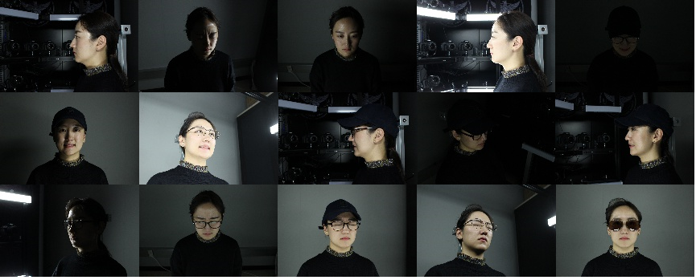
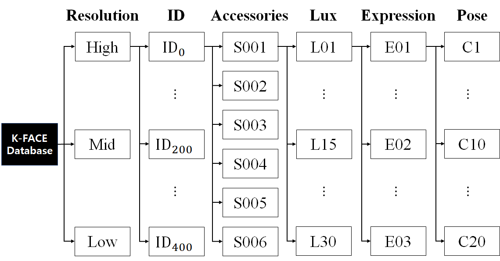

## Installation

### Setup with Conda
```bash
# create a new environment
conda create --name insightKface python=3.7 # or over
conda activate insightKface

#install the appropriate cuda version of pytorch(https://pytorch.org/)
#example:
conda install pytorch torchvision torchaudio cudatoolkit=11.1 -c pytorch -c conda-forge

# install requirements
pip install -r requirements.txt
```

## Data prepration

### K-FACE Database
K-FACE [AI-hub](http://www.aihub.or.kr/aidata/73).

Detail configuration about K-FACE is provided in the paper below.

[K-FACE: A Large-Scale KIST Face Database in Consideration with
Unconstrained Environments](https://arxiv.org/abs/2103.02211)

K-FACE sample images



Structure of the K-FACE database



Configuration of K-FACE


#### Detection & Alignment on K-FACE

```bash
"""
    ###################################################################

    K-Face : Korean Facial Image AI Dataset
    url    : http://www.aihub.or.kr/aidata/73

    Directory structure : High-ID-Accessories-Lux-Emotion
    ID example          : '19062421' ... '19101513' len 400
    Accessories example : 'S001', 'S002' .. 'S006'  len 6
    Lux example         : 'L1', 'L2' .. 'L30'       len 30
    Emotion example     : 'E01', 'E02', 'E03'       len 3
    
    ###################################################################
"""

# example
cd detection

python align_kfaces.py --ori_data_path '/data/FACE/KFACE/High' --detected_data_path 'kface_retina_align_112x112'
```
We referred to [https://github.com/biubug6/Pytorch_Retinaface](https://github.com/biubug6/Pytorch_Retinaface).

#### Training and test datasets on K-FACE 
|Train ID|Accessories|Lux|Expression|Pose|#Image|Variance|
|:------:|:---:|:---:|:---:|:---:|:---:|:---:|
|[T1](https://github.com/Jung-Jun-Uk/insightKface_pytorch/blob/main/recognition/data/KFACE/kface.T1.yaml)|A1|1000|E1|C4-10|2,590|Very Low|
|[T2](https://github.com/Jung-Jun-Uk/insightKface_pytorch/blob/main/recognition/data/KFACE/kface.T2.yaml)|A1-2|400-1000|E1|C4-10|46,620|Low|
|[T3](https://github.com/Jung-Jun-Uk/insightKface_pytorch/blob/main/recognition/data/KFACE/kface.T3.yaml)|A1-A4|200-1000|E1-2|C4-13|654,160|Middle|
|[T4](https://github.com/Jung-Jun-Uk/insightKface_pytorch/blob/main/recognition/data/KFACE/kface.T4.yaml)|A1-A6|40-1000|E1-3|C1-20|3,862,800|High|
||
|**Test ID** |**Accessories**|**Lux**|**Expression**|**Pose**|**#Pairs**|**Variance**|
|[Q1](https://github.com/Jung-Jun-Uk/insightKface_pytorch/blob/main/recognition/data/KFACE/kface.Q1.txt)|A1|1000|E1|C4-10|1,000|Very Low|
|[Q2](https://github.com/Jung-Jun-Uk/insightKface_pytorch/blob/main/recognition/data/KFACE/kface.Q2.txt)|A1-2|400-1000|E1|C4-10|100,000|Low|
|[Q3](https://github.com/Jung-Jun-Uk/insightKface_pytorch/blob/main/recognition/data/KFACE/kface.Q3.txt)|A1-4|200-1000|E1-2|C4-13|100,000|Middle|
|[Q4](https://github.com/Jung-Jun-Uk/insightKface_pytorch/blob/main/recognition/data/KFACE/kface.Q4.txt)|A1-6|40-1000|E1-3|C1-20|100,000|High|

### [MS1M-RetinaFace](https://arxiv.org/abs/1905.00641) (MS1M-R)
MS1M-RetinaFace download link: [The Lightweight Face Recognition Challenge & Workshop](https://github.com/deepinsight/insightface/tree/master/challenges/iccv19-lfr).

We referred to [https://github.com/deepinsight/insightface](https://github.com/deepinsight/insightface).
```bash
#Preprocess 'train.rec' and 'train.idx' to 'jpg'

# example
cd detection

python rec2image.py --include '/data/FACE/ms1m-retinaface-t1/' --output 'MS1M-RetinaFace'
```

## Inference

After downloading the pretrained model, run `test.py`.

### Pretrained Model
For all experiments, [ResNet-34](https://arxiv.org/abs/1512.03385) was chosen as the baseline backbone.

#### The model was trained on KFACE
|Head&Loss|Q1|Q2|Q3|Q4|
|:---:|:---:|:---:|:---:|:---:|
|[ArcFace (s=16, m=0.25)](https://koreatechackr-my.sharepoint.com/:u:/g/personal/rnans33_koreatech_ac_kr/EZ6jsWQ49hhPqvx2TJYsMtsBj2tggTRBuqLtFW6nEaERgw?e=Frg8Z1)|99.50|95.33|86.60|79.42|-|
|[SN-pair (s=64)](https://koreatechackr-my.sharepoint.com/:u:/g/personal/rnans33_koreatech_ac_kr/Edch8gnpE2pDpE8OpzQ9OBEBCNNSlA8GV7iSLAvghVoVwQ?e=GRXyt4)|99.20|95.01|91.84|89.74|
|[MixFace (e=1e-22, m=0.25)](https://koreatechackr-my.sharepoint.com/:u:/g/personal/rnans33_koreatech_ac_kr/EeVMBzPFGjNIrXDZJ9At33YBEp8UjLAdkge0koCOWeOrFg)|**100**|**96.37**|**92.36**|**89.80**|

Note: 

+ For ArcFace, we tested (s,m)={(16,0.5), (32,0.25), (64,0.25), (32,0.5), (64,0.5)}, but the model was not trained properly So, we apply (s,m)=(16,0.25).

```bash
cd recognition

# example
python test.py --weights 'kface.mixface.1e-22m0.25.best.pt' --dataset 'kface' --data_cfg 'data/KFACE/kface.T4.yaml'
```

#### The model was trained on MS1M-R
|Head&Loss|Q2|Q3|Q4|LFW|CFP-FP|AgeDB-30|
|:---:|:---:|:---:|:---:|:---:|:---:|:---:|
|[ArcFace (s=64, m=0.5)](https://koreatechackr-my.sharepoint.com/:u:/g/personal/rnans33_koreatech_ac_kr/EYVV1dGA11pHtMU224i3rRYB_dUPdJB0VsHxTiOjz_h5YA?e=OioJXq)|**98.71**|**86.60**|**82.03**|**99.80**|**98.41**|**98.80**|
|[SN-pair (s=64)](https://koreatechackr-my.sharepoint.com/:u:/g/personal/rnans33_koreatech_ac_kr/EYMHsaIBxU5KsICPRa_y8vkBGQmM8f81o7YpuNkoEgr11w?e=uV01Vp)|92.85|76.36|70.08|99.55|96.20|95.46|
|[MixFace (e=1e-22, m=0.5)](https://koreatechackr-my.sharepoint.com/:u:/g/personal/rnans33_koreatech_ac_kr/EQ-8bjuohCdCuPLMW__R2yMBaLUBH8J7s3j_gVfk6SQ6qA?e=dScyfb)|97.36|82.89|76.95|99.68|97.74|97.25|

Note: 

+ When you train with the metric loss(e.g. SN-pair, N-pair, etc) on MS1M-R, don't use the dropout function of line number 204 of the [code](https://github.com/Jung-Jun-Uk/insightKface_pytorch/blob/main/recognition/models/iresnet.py) because the model is not trained properly.

```bash
cd recognition

# example
python test.py --weights 'face.mixface.1e-22m0.5.best.pt' --dataset 'face' --data_cfg 'data/face.all.yaml'
```

#### The model was trained on MS1M-R+T4
|Head&Loss|Q2|Q3|Q4|LFW|CFP-FP|AgeDB-30|
|:---:|:---:|:---:|:---:|:---:|:---:|:---:|
|[ArcFace (s=8, m=0.25)](https://koreatechackr-my.sharepoint.com/:u:/g/personal/rnans33_koreatech_ac_kr/EVebAdOEAVVLmasSyc0DzQYBZMCtF67eRLnYQr3iGQuKZA?e=lcwtYV)|76.58|73.13|71.38|99.46|**96.75**|93.83|
|[SN-pair (s=64)](https://koreatechackr-my.sharepoint.com/:u:/g/personal/rnans33_koreatech_ac_kr/EQ6JQycpq9pMhAR0czQ4ihoBrDhRBCZ1JVImmg5Dmzq42w?e=WaE72e)|98.37|94.98|93.33|99.45|94.90|93.45|
|[MixFace (e=1e-22, m=0.5)](https://koreatechackr-my.sharepoint.com/:u:/g/personal/rnans33_koreatech_ac_kr/EQae8dv9wTJFn3ecSQmBRrcBFh1as-AmlEn2xk6puisVBA?e=Sif7eN)|**99.27**|**96.85**|**94.79**|**99.53**|96.32|**95.56**|

Note: 
+ For ArcFace, we tested (s,m)={(8, 0.5), (16, 0.25), (16,0.5), (32,0.25), (64,0.25), (32,0.5), (64,0.5)}, but the model was not trained properly So, we apply (s,m)=(8,0.25).
+ When you train with the metric loss(e.g. SN-pair, N-pair, etc) on MS1M-R+T4, don't use the dropout function of line number 204 of the [code](https://github.com/Jung-Jun-Uk/insightKface_pytorch/blob/main/recognition/models/iresnet.py) because the model is not trained properly. 

```bash
cd recognition

# example
python test.py --weights 'merge.mixface.1e-22m0.5.best.pt' --dataset 'merge' --data_cfg 'data/merge.yaml'
```

## Training
